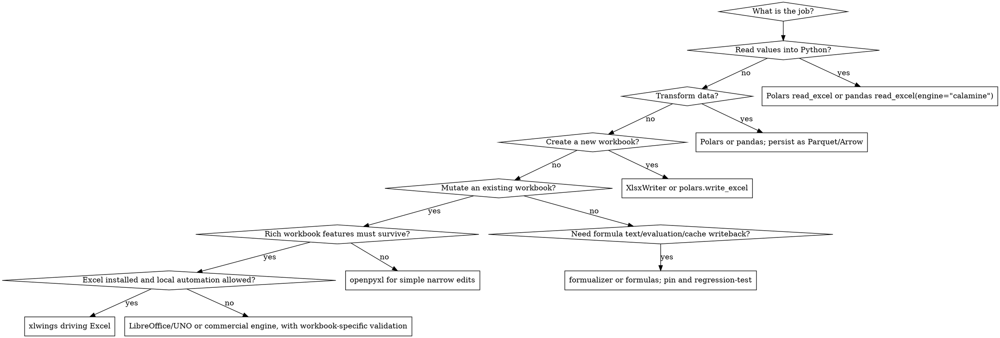

# Working with Excel Workbooks

## Overview

Treat an Excel workbook as an executable business document, not a grid of cells.

**Core principle:** a successful `save()` proves only that a file was written. It does not prove that formulas, workbook objects, formatting, or business logic survived.

Every task turns on two questions: **(1) which of the four jobs is this?** (read, compute, produce-new, mutate-existing — see below) and **(2) which backend preserves what must survive?** Whichever job it is, run it through the same disciplined process — **inspect, plan, mutate, recalculate, verify** (see Required Workflow). The common failure is forcing all work through `pandas` + `openpyxl`. That is wrong: pick the tool by job, and treat a styled or formula-heavy workbook as a document, not a dataframe container.

## The Four Jobs

1. **Read** tabular data from a workbook.
2. **Compute or transform** data in Python.
3. **Produce a new workbook** as an output artifact.
4. **Mutate an existing workbook document** while preserving formulas, charts, styles, validation, macros, tables, and cached values.

**Default posture:** read with calamine/fastexcel, compute with Polars or pandas, produce new workbooks with XlsxWriter-backed APIs, mutate rich existing workbooks with real Excel (`xlwings`), a validated LibreOffice workflow, or a commercial engine. Demote `openpyxl` to simple structural edits where losing advanced Excel features is acceptable.

## Tool Selection

| Job | Prefer | Avoid |
|-----|--------|-------|
| Read `.xlsx/.xlsb/.xls` into a dataframe | `polars.read_excel()` (calamine/fastexcel) or `pandas.read_excel(engine="calamine")` | pandas default reader when speed matters; streaming a large export through openpyxl |
| Transform data | Polars for typed, fast, lazy-capable pipelines; pandas for small stable code | pandas API shims that hide migration semantics |
| Hand data between Python steps | Parquet or Arrow | `.xlsx` as internal interchange |
| Produce a new styled report | XlsxWriter or `polars.DataFrame.write_excel()` | openpyxl as the default report writer |
| Append simple data to a plain existing workbook | pandas `ExcelWriter(..., mode="a", engine="openpyxl")` only when template fidelity is not critical | pandas writes into rich templates |
| Targeted edit to a rich existing workbook (formulas/charts/pivots must survive) | `xlwings` driving installed Excel; else validated LibreOffice; else a commercial engine (Aspose.Cells, Spire.XLS) headless | `openpyxl` round-trips of rich workbooks |
| Simple/narrow edits to a conventional workbook | `openpyxl` with `data_only=False`, writing only intended cells | touching formula/chart/table cells casually |
| Recalculate formulas / preserve Excel behavior | Excel via `xlwings`, Microsoft Graph, or Office Scripts; headless: a commercial engine, a *validated* LibreOffice workflow, or a pure-Python engine (`formualizer`/`formulas`) | assuming openpyxl/XlsxWriter calculate anything |
| Read formula text or evaluate formulas in pure Python | `formualizer` (Rust, beta) or `formulas` (stable), after representative tests | calamine/Polars/pandas value reads treated as formula results |

### High-Risk Defaults

- **Existing workbook with formulas, charts, conditional formatting, tables, validation, macros, pivots, slicers, or named ranges:** use `xlwings` if Excel is available. If not, test LibreOffice on the exact workbook class before trusting it, or use a commercial engine. Never assume `openpyxl` preserves these.
- **Fresh output workbook:** use XlsxWriter directly or through `polars.write_excel`. XlsxWriter is excellent for creating files; it *cannot* edit an existing template.
- **Read-only tabular extraction:** use calamine — but it is the fast **value** path, not full fidelity. For a few rows out of a huge workbook, lazy `openpyxl`/`pyxlsb` can be faster.
- **pandas engine:** the default `.xlsx` reader is still `openpyxl` in pandas 3.0.x, but the flip is now announced — pandas 3.1 dev docs deprecate it: "the default engine will change from `openpyxl` to `calamine` in a future version." Pin the engine explicitly (`engine=` or the `io.excel.xlsx.reader` option) in durable code so the default change can't move it under you.
- **openpyxl maintenance:** last stable release is 3.1.5 (mid-2024). Fine for simple edits; do not lean on it for evolving Excel features.
- **Formula work:** distinguish formula text, cached value, calculation, and cache writeback — separate capabilities (see Formula & Cache Handling).

## Required Workflow

### 1. Preserve and inspect

- Never overwrite the source unless explicitly required. Work on a copy.
- Record the extension, size, sheet names, hidden sheets, defined names, tables, merged ranges, formulas, validations, conditional formatting, charts/drawings, external links, protection, and VBA presence.
- Load editable workbooks with `data_only=False`. Loading with `data_only=True` and then saving replaces formulas with cached values.
- Use `keep_vba=True` for `.xlsm`, but do not assume this makes arbitrary macro-enabled workbooks safe to round-trip.

### 2. Plan a narrow patch

Express intended work as explicit operations:

```text
write_table(sheet, anchor, rows)
patch_cells(sheet, values)
set_formulas(sheet, formulas)
apply_format(sheet, range, style)
add_validation(sheet, range, rule)
```

Define invariants before editing: sheets that must remain, formulas that must survive, allowed changed ranges, totals that must reconcile, and objects that must not disappear.

### 3. Mutate with the correct backend

- Use `openpyxl` for targeted edits to conventional workbooks; keep `data_only=False` and write only intended cells.
- Use XlsxWriter for new workbooks, not for modifying existing ones.
- Use `xlwings` (or a commercial engine) for rich workbooks whose objects must survive.
- Do not pass a formatted workbook through pandas merely to edit cells.
- Avoid inserting/deleting rows and columns in complex sheets unless references, tables, charts, names, and formulas are audited afterward.
- Excel formulas must use English function names and commas.
- Preserve styles by copying from a known template cell or applying a named style; do not improvise a new format per cell.

### 4. Recalculate deliberately

`openpyxl` and XlsxWriter do not calculate Excel formulas. When current results matter, recalculate with Excel (`xlwings`), Microsoft Graph, Office Scripts, a commercial engine, or a *validated* LibreOffice workflow. Setting a workbook to recalculate on open is not equivalent to delivering verified cached results. See Formula & Cache Handling for tool-by-tool behavior.

### 5. Verify after saving

At minimum:

1. Reopen the output.
2. Assert the requested values and formulas.
3. Compare sheet names, hidden state, merged ranges, table references, defined names, formula counts, and VBA presence against the source.
4. Run domain checks: totals, balances, unique keys, date bounds, row counts.
5. Open or render critical sheets when visual layout matters.
6. Confirm the output exists and is readable before reporting completion.

## Reading and Computing

- **Polars:** use when speed, strict typing, lazy execution, joins/grouping, or pipeline standardization matters. It reads Excel through `fastexcel`/calamine (the default since Polars 1.0) and writes Excel through XlsxWriter-backed `write_excel`.
- **pandas:** use when the surrounding code is already pandas or the dataset is small. For Excel reads, explicitly pass `engine="calamine"` when you want the Rust path; the default `.xlsx` engine is still `openpyxl` in 3.0.x, with a formal deprecation (3.1 dev) announcing a future switch to calamine — another reason to pin.
- **calamine / fastexcel / python-calamine:** fast value extraction. Treat them as readers of workbook cell values, not Excel document editors.
- **Parquet/Arrow:** use between scripts. Do not make intermediate `.xlsx` files unless humans must inspect them at that point.

Polars migration checks:

- Audit `null` vs `NaN`; Polars has real nulls and stricter typing.
- Remove index-dependent logic; select, join, and sort explicitly.
- Add `.sort()` after joins/grouping where output order matters.
- Replace row-wise pandas idioms with expressions.
- Pin `POLARS_MAX_THREADS` only when constrained CI or reproducible resource use needs it.

## Existing-Workbook Mutation

Use this order for workbook-preserving edits:

1. **Make a copy first.** Never test a writer on the source template.
2. **If Excel is installed and local automation is acceptable, use `xlwings`.** It drives the Excel application on Windows/macOS, so Excel performs the save and recalculation. (There is no Linux Excel automation. *xlwings Server* runs Python on Linux/Docker and serves Excel over the web via Office Scripts/Office.js — that is a deployment model, **not** headless Excel automation or a recalculation engine.)
3. **If headless, use LibreOffice/UNO only after validation,** or a commercial engine (Aspose.Cells, Spire.XLS) that embeds its own formula/chart engine. Verify critical formulas, charts, defined names, tables, pivots, and macro expectations against a known-good Excel-opened file.
4. **Use `openpyxl` only for simple files or narrow edits.** Keep `data_only=False`, write only intended input cells, and do not expect it to update dependent formulas, cached values, charts, tables, or advanced Excel metadata.

Local `xlwings` pattern:

```python
import xlwings as xw

with xw.App(visible=False) as app:
    wb = app.books.open("model.xlsx")
    ws = wb.sheets["Inputs"]
    ws.range("B2").value = 1_250_000
    ws.range("B3").value = 0.085
    wb.save("model.updated.xlsx")
    wb.close()
```

Cost: requires installed Excel; no Linux Excel automation; macOS uses Apple events and needs Automation permission. Use visible/debug mode first when workbook behavior is unclear.

## Formula & Cache Handling

Do not say "the formulas work" until you know which of these you need:

- **Formula text:** the literal expression stored in a cell.
- **Cached value:** the last value some engine stored for that formula.
- **Calculation:** recomputing formulas after inputs change.
- **Cache writeback:** writing formula cells *plus* cached results so readers that do not calculate still see useful values.

Tool guidance:

- **openpyxl** preserves/writes formula strings in simple cases but does not calculate them. `data_only=True` reads cached values, and saving that workbook can destroy formula information. Use `data_only=False` for editing.
- **XlsxWriter** can write formulas into new files. It does not calculate them; results default to a cached `0` unless you supply an explicit value.
- **xlwings** uses Excel for calculation and save — the closest automation path when Excel fidelity matters (installed Excel, Windows/macOS).
- **LibreOffice** recalculates many formulas (`Recalculate Hard`, UNO `calculateAll()`) but is *not* a drop-in Excel engine. Compatibility keeps improving (recent releases added Excel-aligned array/text functions such as `CHOOSECOLS`/`HSTACK`/`VSTACK`; the 26.8 beta further improves XLSX handling) but is not parity. Validate per workbook — VBA, links, dynamic arrays, edge-case semantics.
- **Microsoft Graph Excel API / Office Scripts** deliver Excel-fidelity recalc for supported business `.xlsx` files, but require Microsoft 365 licensing and **delegated** (work/school) auth — not app-only server automation, and not personal accounts. Closer to Excel fidelity than LibreOffice or Python evaluators for supported workbooks; still validate.
- **formualizer** — Rust-backed engine (v0.8.x, Beta). Parses, evaluates, *and* mutates workbooks, and writes recalculated cached values back to XLSX (`recalculate_file`) across 320+ functions, plus an introspection API (`inspect_cell`, `precedents`, `dependents`, `trace`). Fast-moving with breaking changes between minors (0.8.0 changed `VLOOKUP`/`HLOOKUP` to Excel's approximate-match default and reworked graph-mutation returns; five releases shipped in August 2026 alone); pin the exact version and regression-test representative formulas.
- **formulas** — mature pure-Python interpreter (v1.3.x, stable). Now covers dynamic arrays and modern functions (`LAMBDA`, `LET`, `XLOOKUP`, `XMATCH`, `UNIQUE`, `SORT`, `FILTER`, `MAP`, `REDUCE`), but coverage is ~90% (Automation, Cube, Database, and Web categories are absent), volatiles like `RAND`/`NOW` are treated as impure, and external links resolve only for local linked `.xlsx`. Test your exact function set.
- **Commercial engines** (Aspose.Cells, Spire.XLS) embed formula-calculation engines that read/write/recalc complex workbooks without Excel installed. Proprietary; benchmark fidelity on your own workbook class rather than trusting "high fidelity" as a guarantee.

When regression-testing formula results, pin Excel's **Compatibility Version** — Current Channel workbooks moved to Version 2 (April 2026), changing Unicode-surrogate behavior in `LEN`/`MID`/`FIND`/`SEARCH`/`REPLACE`.

## Agent-Oriented Tooling (early, evaluate before trusting)

A new 2025–2026 category: spreadsheet servers built for LLM agents rather than for scripts. All are young (tens of GitHub stars); treat them as candidates to evaluate against the Required Workflow, not as proven backends.

- **spreadsheet-kit / `spreadsheet-mcp`** (PSU3D0, same author as formualizer) — CLI (`asp`) + MCP server backed by formualizer, with optional LibreOffice recalc. Notable for agent-shaped safety features this skill otherwise has to improvise: dry-run workflows, staged edits, dependency tracing, and a verification layer that proves outcomes instead of assuming a `save()` worked.
- **`excel-mcp-server`** (haris-musa) — MCP server for creating/reading/modifying workbooks without a local Excel install; openpyxl-backed, so it inherits every openpyxl round-trip risk in this skill.
- **IronCalc** (+ `ironcalc-mcp`) — open-source Rust spreadsheet engine (0.8.x, Alpha; Python/wasm bindings, `.xlsx` import/export); a possible future headless-recalc option, but charts/pivots are still on the roadmap — not a fidelity peer of Excel/LibreOffice/commercial engines.

The deciding question for any of these is the *engine underneath* (openpyxl? formualizer? live Excel? Graph?) — MCP is an orchestration protocol, not a spreadsheet engine, and adds no fidelity by itself. If one is already installed and exposed as a tool in the current session, prefer it for read/inspect steps; for mutation of rich workbooks, hold it to the same verification bar as openpyxl.

## Stop Conditions

Do not silently round-trip a workbook through `openpyxl` when important content includes Power Query, the Data Model, slicers, pivot caches, embedded objects, digital signatures, unsupported shapes, or sensitive external links. Use a real Excel engine (or a commercial one), or report that safe mutation is unavailable.

## Repair-Prompt Triage

When Excel says it found a problem with workbook content, stop treating the writer as safe.

1. Preserve the broken output and the original input.
2. Identify the last writer: `openpyxl`, pandas `ExcelWriter`, XlsxWriter, LibreOffice, a commercial engine, or Excel.
3. Check whether formula cells, chart XML, table ranges, data-validation ranges, named ranges, or cached formula values were touched.
4. Reproduce with the smallest workbook that still breaks.
5. If the last writer was `openpyxl` or pandas against a rich template, switch to `xlwings`, a validated LibreOffice workflow, or a commercial engine.
5a. For genuinely corrupted files (not writer-induced damage), prefer Excel's native repair via COM — `Workbooks.Open(..., CorruptLoad=xlRepairFile)` or `xlExtractData` — when Windows Excel is available; a successful openpyxl load-and-save is not "repair" until you check what was discarded.
6. Verify by opening in Excel and comparing business-critical cells — not only by checking that the file opens.

## Output Contract

Report:

- output file path;
- backend used;
- sheets and ranges changed;
- whether formulas were recalculated, and by what;
- verification checks performed and their results;
- unresolved fidelity risks.

Never describe a workbook as complete, correct, or validated without evidence from the verification step.

## Common Mistakes

| Mistake | Why it breaks | Fix |
|---------|---------------|-----|
| Round-tripping a rich template through `openpyxl` | The file is reconstructed through openpyxl's object model; unsupported rich features are lost or rewritten | Drive Excel with `xlwings`, validate LibreOffice, or use a commercial engine |
| Using pandas `ExcelWriter` against a styled template | Sheet writes can replace or disturb workbook document features | Write fresh reports, or mutate the template through Excel/LibreOffice/commercial |
| Assuming XlsxWriter can edit an existing workbook | XlsxWriter only creates new `.xlsx` files | Use `openpyxl` for simple append/edit, or `xlwings`/commercial for rich templates |
| Assuming formula text means results are current | Most Python libraries do not calculate Excel formulas | Recalculate with Excel, Graph/Office Scripts, a commercial engine, or a tested formula engine |
| Saving an `openpyxl` workbook loaded with `data_only=True` | Formula cells are represented as cached values, not formulas | Edit with `data_only=False`; recalc with Excel/LibreOffice/commercial |
| Writing modern formulas without testing OOXML syntax | Dynamic arrays and newer functions may need exact Excel-compatible serialization | Prefer Excel/XlsxWriter paths and validate in Excel |
| Using `.xlsx` as internal interchange | Slow, lossy, feature-heavy | Use Parquet/Arrow |

## Minimal Safe Pattern

```python
from pathlib import Path
from shutil import copy2
from openpyxl import load_workbook

source = Path("input.xlsx")
output = Path("output.xlsx")
copy2(source, output)

wb = load_workbook(
    output,
    data_only=False,
    keep_vba=source.suffix.lower() == ".xlsm",
)

ws = wb["Summary"]
ws["B2"] = "Updated"
wb.save(output)

check = load_workbook(
    output,
    data_only=False,
    keep_vba=output.suffix.lower() == ".xlsm",
)
assert check["Summary"]["B2"].value == "Updated"
assert output.exists() and output.stat().st_size > 0
```

## Decision Flow



## Sources

Reviewed 2026-08-25. Re-check before large migrations: pandas, Polars, fastexcel, and formula-engine behavior change quickly. Current-as-of-review anchors: pandas 3.0.5 (default `.xlsx` reader still openpyxl; 3.1 dev docs formally deprecate that default in favor of calamine), Polars 1.44, python-calamine 0.8.2, fastexcel 0.21.0, XlsxWriter 3.2.9, openpyxl 3.1.5 (no stable release since mid-2024), xlwings 0.36.17, formualizer 0.8.4 (Beta), formulas 1.3.4 (stable), LibreOffice 26.2.5 stable (26.8 in beta), Aspose.Cells 26.8, Spire.XLS 16.7.1.

- pandas `read_excel` engine behavior: https://pandas.pydata.org/pandas-docs/dev/reference/api/pandas.read_excel.html
- pandas I/O guide: https://pandas.pydata.org/pandas-docs/stable/user_guide/io.html
- pandas `ExcelWriter`: https://pandas.pydata.org/pandas-docs/stable/reference/api/pandas.ExcelWriter.html
- Polars Excel I/O: https://docs.pola.rs/user-guide/io/excel/
- Polars `write_excel`: https://docs.pola.rs/api/python/version/1/reference/api/polars.DataFrame.write_excel.html
- fastexcel: https://pypi.org/project/fastexcel/
- python-calamine: https://pypi.org/project/python-calamine/
- openpyxl editing caveats: https://openpyxl.readthedocs.io/en/3.1/tutorial.html
- XlsxWriter FAQ: https://xlsxwriter.readthedocs.io/faq.html
- xlwings installation/platform notes: https://docs.xlwings.org/en/latest/installation.html
- xlwings Server: https://server.xlwings.org/
- LibreOffice hard recalculation: https://help.libreoffice.org/latest/en-US/text/scalc/01/recalculate_hard.html
- Microsoft Graph workbook calculate: https://learn.microsoft.com/en-us/graph/api/workbookapplication-calculate?view=graph-rest-1.0
- Office Scripts calculation sample: https://learn.microsoft.com/en-us/office/dev/scripts/resources/samples/automate-tasks-on-all-excel-files-in-folder
- formualizer: https://pypi.org/project/formualizer/  ·  releases: https://github.com/PSU3D0/formualizer/releases
- spreadsheet-kit / spreadsheet-mcp: https://github.com/PSU3D0/spreadsheet-mcp
- IronCalc: https://github.com/ironcalc/IronCalc
- pandas 3.1 dev engine deprecation: https://pandas.pydata.org/pandas-docs/dev/reference/api/pandas.read_excel.html
- formulas: https://pypi.org/project/formulas/  ·  changelog: https://formulas.readthedocs.io/en/stable/change.html
- Aspose.Cells for Python: https://pypi.org/project/aspose-cells-python/
- Spire.XLS for Python: https://pypi.org/project/spire-xls/
- Excel compatibility versions: https://support.microsoft.com/en-us/office/compatibility-versions-49f5d3bf-d9a4-47a3-9db8-e776f664cbf9
